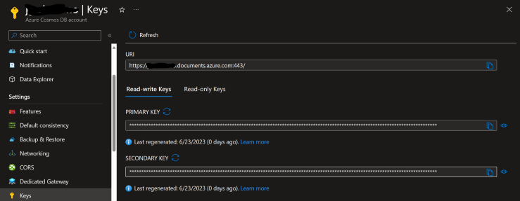
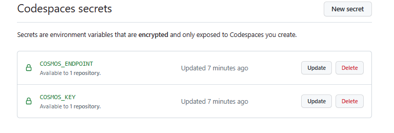

# ETL in GitHub Codespaces

## Extract, Transform, and Load Operations with Python & Pandas library with Jupyter Notebooks and Azure Cosmos DB

This sample loads a csv file as a Pandas dataframe, filters the records by airports located in the United States, then the filtered data into JSON. A sample of the pared data is then loaded into Azure Cosmos DB.

### Instructions 
Convert a filtered CSV File into JSON, then insert into Azure Cosmos DB in minutes with GitHub Codespaces

1. [Create a Cosmos DB NoSQL Account, you can stop after creating the resource](https://learn.microsoft.com/en-us/azure/cosmos-db/nosql/quickstart-portal)

2. After account is created in the Azure Portal, navigate to the resource (you can find it in your notifications)

3. To the right of the resource overview select `Keys`. locate the `URI`, and `PRIMARY KEY` secrets.

    
 
4. Set copied secrets it as secrets in your [Codespaces settings here](https://github.com/settings/codespaces). 
    **`URI` should be the `COSMOS_ENDPOINT` secret and `PRIMARY KEY` should be the  `COSMOS_KEY` secret**
     

5. Run the Notebook

6. **[Clean up your Cosmos DB Account Resources after you're done!](https://learn.microsoft.com/en-us/azure/cosmos-db/nosql/quickstart-portal#clean-up-resources)**
